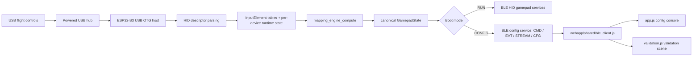

# Architecture

## Purpose
Deterministic system overview for the current `main` branch.

This file is the top-level architecture map for future AI assistants and human maintainers.

Related files:
- `main/main.cpp`
- `main/usb_host_manager.cpp`
- `main/hid_device_manager.cpp`
- `main/mapping_engine.h`
- `main/ble_gamepad.cpp`
- `main/ble_config_service.h`
- `main/ble_config_service.cpp`
- `webapp/shared/ble_client.js`
- `docs/interfaces/BLE_CONTRACTS.md`

## Dependencies
### Hardware
- USB HID peripherals
  - joystick
  - throttle
  - pedals
  - other USB HID flight controls
- powered USB hub
- ESP32-S3 in USB OTG host mode
- BLE host device
  - browser running the WebApp in CONFIG mode
  - game host / operating system in RUN mode

### Firmware modules
- `main/main.cpp`
- `main/usb_host_manager.cpp`
- `main/hid_device_manager.cpp`
- `main/mapping_engine.cpp`
- `main/ble_gamepad.cpp`
- `main/ble_config_service.cpp`

### WebApp modules
- `webapp/shared/ble_client.js`
- `webapp/app.js`
- `webapp/validation.js`

## Data Structures/Interfaces
### Core responsibility split
#### Firmware
- act as USB host for one or more HID devices
- parse HID report descriptors into device-local elements
- decode incoming HID reports into runtime values
- compute a deterministic canonical `GamepadState`
- expose either:
  - a BLE HID gamepad in RUN mode
  - a custom BLE configuration service in CONFIG mode

#### WebApp
- connect to the custom CONFIG service over Web Bluetooth
- issue JSON commands over `CMD`
- receive JSON and descriptor payloads over `EVT`
- receive 16-byte sample payloads over `STREAM`
- read/write full configuration JSON over `CFG`
- present:
  - configuration console
  - validation scene

### Hardware → software pipeline

### Boot/runtime modes
#### RUN mode
- selected by persisted app mode in NVS
- firmware initializes BLE HID gamepad services
- firmware sends host-visible HID input reports based on canonical `GamepadState`
- WebApp is not part of the active RUN-mode data path

#### CONFIG mode
- selected by persisted app mode in NVS
- firmware initializes the custom config GATT service
- HID output is suppressed
- WebApp connects through `webapp/shared/ble_client.js`
- WebApp can:
  - enumerate devices
  - inspect elements
  - fetch descriptors
  - stream live element samples
  - read/write configuration
  - save profile to NVS
  - request reboot into RUN mode

### Firmware data-flow summary
1. `usb_host_manager_init()` starts the USB host daemon task.
2. `hid_device_manager_init()` starts the HID host logic.
3. HID descriptors are parsed into `InputElement` metadata.
4. HID input reports update per-device runtime state.
5. `mapping_engine_compute()` produces a canonical merged `GamepadState`.
6. `translate_usb_to_ble()` in `main/main.cpp` is identity-only.
7. Final output path depends on mode:
   - RUN → `ble_gamepad_send_state()`
   - CONFIG → `ble_config_service_stream_tick()` and command handling in `ble_config_service.cpp`

### WebApp data-flow summary
1. `BleClient.connect()` resolves the primary CONFIG service and characteristics.
2. `BleClient.ensureEvtSubscription()` subscribes to `EVT` notifications.
3. `BleClient.sendCommand()` writes JSON to `CMD` and waits for the matching `EVT` response.
4. `BleClient.handleEvtNotification()` reassembles framed `EVT` chunks.
5. `BleClient.handleStreamNotification()` parses the 16-byte `STREAM` payload.
6. `BleClient.getConfig()` reads `CFG` first, then falls back to inline command responses if required.

## Expected State Changes
### Device side
- USB device connect/disconnect changes the active device set.
- default mapping profile may regenerate when connected device topology changes.
- CONFIG mode commands may mutate in-memory profile state immediately.
- `save_profile` persists the current normalized profile to NVS.
- reboot commands change the next active mode.

### WebApp side
- `connect()` populates characteristic handles and enables `EVT` notifications.
- `get_devices()` refreshes `devices[]` and invalidates stale caches.
- `get_elements()` hydrates per-device metadata.
- `get_descriptor()` populates descriptor cache.
- `getConfig()` updates `currentConfig`, `savedConfigString`, and `pendingChanges`.
- `startStream()` enables sample flow and updates stream state.

## Known Limitations
- `device_id` is session-local and derived from the connected USB device address, not a persistent hardware identity.
- CONFIG mode still uses two wire styles for configuration retrieval:
  - `CFG` characteristic
  - inline `get_config` response fallback
- RUN-mode BLE HID and CONFIG-mode GATT are separate transport surfaces and must not be conflated.
- The powered USB hub is external to the firmware contract; power behavior is not encoded in software interfaces.
