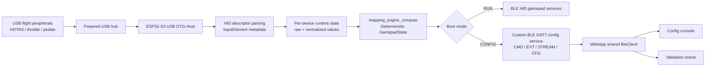

# ARCHITECTURE

## Purpose
Deterministic, high-level system overview for `gamepad-gateway-usb2ble`.

This document is the top-level architecture map for future AI assistants and human maintainers. It describes the end-to-end runtime path from physical USB peripherals through the ESP32-S3 firmware to the browser-based configuration tools.

Related documents:
- [docs/interfaces/BLE_CONTRACTS.md](docs/interfaces/BLE_CONTRACTS.md)

## Dependencies
### Firmware surfaces
- `main/main.cpp`
- `main/ble_config_service.h`
- `main/mapping_engine.h`

### WebApp surfaces
- `webapp/shared/ble_client.js`

## Data Structures/Interfaces
### System roles
#### Physical USB/HID layer
- One or more USB HID peripherals are attached through a **powered USB hub**.
- The ESP32-S3 operates as the **USB OTG host**.
- HID report descriptors are parsed into firmware-side element metadata.

#### Firmware layer
- Enumerates USB HID devices.
- Builds a canonical `GamepadState` from parsed HID inputs.
- Applies deterministic mapping logic via `mapping_engine_compute()`.
- Exposes one of two BLE modes:
  - **RUN mode**: BLE HID gamepad output.
  - **CONFIG mode**: custom GATT configuration service.

#### WebApp layer
- Connects over Web Bluetooth to the **CONFIG** service.
- Uses a shared BLE client implementation in `webapp/shared/ble_client.js`.
- Provides two browser experiences:
  - **Configuration console**
  - **Validation scene**

### End-to-end pipeline

### Runtime mode split
#### RUN mode
- Firmware initializes BLE HID services.
- Firmware serializes the canonical `GamepadState` into the BLE HID input report.
- Browser tooling is not the primary consumer in this mode.

#### CONFIG mode
- Firmware initializes the custom config service.
- The web client connects to:
  - `CMD`
  - `EVT`
  - `STREAM`
  - `CFG`
- Configuration, descriptor inspection, telemetry, and validation happen in-browser.

### Responsibility split
#### Firmware responsibility
- USB host management.
- HID descriptor parsing.
- Per-device runtime state management.
- Deterministic mapping to canonical outputs.
- BLE service hosting.
- Binary + JSON contract production.

#### WebApp responsibility
- BLE transport orchestration over Web Bluetooth.
- Command queueing and timeout control.
- EVT chunk reassembly.
- STREAM binary payload parsing.
- CFG-first configuration retrieval with inline fallback.
- UI rendering for config and validation workflows.

## Expected State Changes
### Boot
- `app_mode_init()` selects `RUN` or `CONFIG`.

### CONFIG mode
- BLE custom service is active.
- WebApp may connect and subscribe to notifications.
- Firmware emits:
  - EVT framed payloads
  - STREAM 16-byte samples
  - CFG JSON reads/writes

### RUN mode
- BLE HID path is active.
- Firmware emits host-facing HID gamepad state.

## Known Limitations
- The firmware-to-web contract is split across binary STREAM packets, JSON EVT responses, and CFG characteristic reads/writes.
- `translate_usb_to_ble()` in `main/main.cpp` is identity-only; real mapping occurs earlier in `mapping_engine_compute()`.
- Future changes to payload structure must update [docs/interfaces/BLE_CONTRACTS.md](docs/interfaces/BLE_CONTRACTS.md) first.
