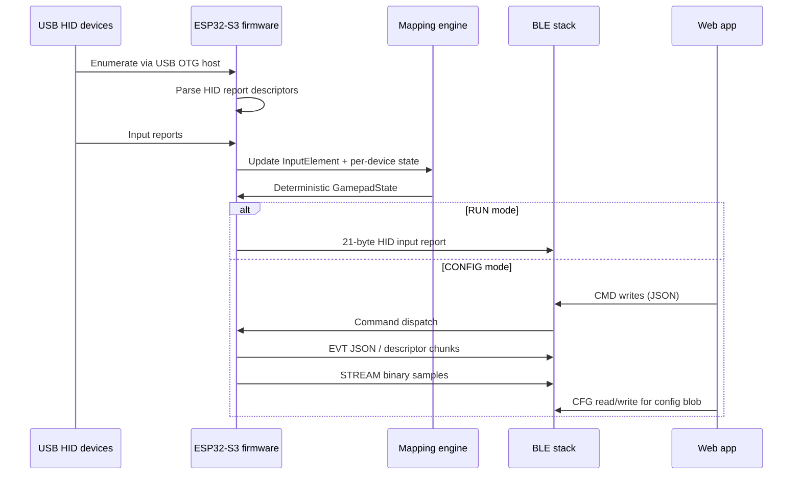

# Architecture

## Purpose
High-level system overview for **Gamepad Gateway / USB-to-BLE HOTAS Bridge**. This file is the entry point for the project knowledge base and links to the deeper firmware, webapp, interface, and CI/CD documents.

Related documents:
- [docs/README.md](docs/README.md)
- [docs/architecture/SYSTEM_OVERVIEW.md](docs/architecture/SYSTEM_OVERVIEW.md)
- [docs/interfaces/BLE_CONTRACTS.md](docs/interfaces/BLE_CONTRACTS.md)
- [AUDIT_REPORT.md](AUDIT_REPORT.md)

## Dependencies
- Firmware entrypoint: `main/main.cpp`
- USB host stack: `main/usb_host_manager.cpp`, `main/hid_device_manager.cpp`
- BLE RUN mode: `main/ble_gamepad.cpp`
- BLE CONFIG mode: `main/ble_config_service.cpp`
- Web config console: `webapp/index.html`, `webapp/app.js`
- Web validation scene: `webapp/validation.html`, `webapp/validation.js`
- GitHub Actions: `.github/workflows/ci.yml`, `.github/workflows/promote-artifacts.yml`

## Data Structures/Interfaces
### Subsystems
1. **USB intake**
   - ESP32-S3 USB OTG host enumerates one or more HID devices through a powered hub.
   - HID report descriptors are parsed into `InputElement[]` metadata.
   - Input reports update per-device `GamepadState` and `InputElement` runtime values.
2. **Deterministic mapping layer**
   - `mapping::MappingProfile` maps `(device_id, element_id)` sources to canonical output axes.
3. **BLE transport**
   - **RUN mode** exposes a HID-over-GATT gamepad profile.
   - **CONFIG mode** exposes a custom GATT service with `CMD`, `EVT`, `STREAM`, and `CFG` characteristics.
4. **Web clients**
   - Main config console: mapping, descriptor inspection, telemetry, profile import/export, flashing links.
   - Validation scene: visualization-oriented config client with a separate implementation.

## Expected State Changes
- Boot reads persisted app mode from NVS.
- CONFIG mode exposes the custom service and suppresses HID output.
- RUN mode advertises HID/BAS/DIS services and emits HID input reports.

## Known Limitations
- The main config console and validation scene do **not** currently implement the exact same client contract. See [AUDIT_REPORT.md](AUDIT_REPORT.md).
- Some comments and headers have drifted from implementation, especially around config transport and schema versioning.
