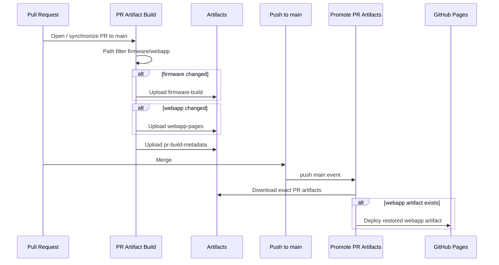

# CI/CD Overview

## Purpose
Document the authoritative GitHub Actions pipeline and Pages promotion model for the repository.

## Dependencies
- `.github/workflows/ci.yml`
- `.github/workflows/promote-artifacts.yml`

## Data Structures/Interfaces
### Workflows
1. **PR Artifact Build** (`ci.yml`)
   - pull requests targeting `main`
   - path filtering for firmware vs webapp
   - uploads `pr-build-metadata`, `firmware-build`, `webapp-pages`
2. **Promote PR Artifacts** (`promote-artifacts.yml`)
   - push to `main`
   - resolves merged PR and successful PR build run
   - downloads exact PR artifacts
   - deploys Pages only when webapp changed

## Expected State Changes
- PRs produce artifacts only for changed components.
- Main promotion reuses PR artifacts and does not rebuild application code.
- GitHub Pages deploys only from `main`.

## Known Limitations
- The promotion flow depends on GitHub associating the merged commit with a PR and the PR head SHA matching a successful artifact run.
