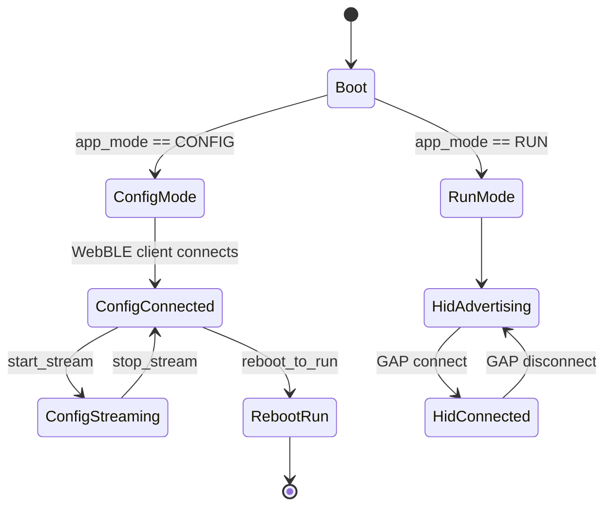
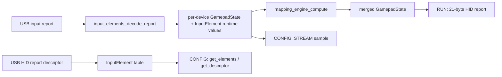

# System Overview

## Purpose
Describe the live architecture of the USB hub → ESP32-S3 → BLE → Web client system using implementation-based terminology.

Related documents:
- [../../ARCHITECTURE.md](../../ARCHITECTURE.md)
- [../interfaces/BLE_CONTRACTS.md](../interfaces/BLE_CONTRACTS.md)
- [../firmware/HID_PIPELINE.md](../firmware/HID_PIPELINE.md)
- [../webapp/CONFIG_CONSOLE.md](../webapp/CONFIG_CONSOLE.md)

## Dependencies
- `main/main.cpp`
- `main/usb_host_manager.cpp`
- `main/hid_device_manager.cpp`
- `main/mapping_engine.cpp`
- `main/ble_gamepad.cpp`
- `main/ble_config_service.cpp`
- `webapp/app.js`
- `webapp/validation.js`

## Data Structures/Interfaces
### Boot modes
- `APP_MODE_RUN`
  - BLE HID gamepad advertised
  - CONFIG service disabled
  - host-visible 21-byte HID input report emitted
- `APP_MODE_CONFIG`
  - custom CONFIG service advertised
  - HID gamepad output paused
  - web clients may issue commands and subscribe to telemetry

### Core runtime entities
- `InputElement`
- `HidDeviceContext`
- `mapping::MappingProfile`
- `GamepadState`

## Expected State Changes
- USB connect/disconnect updates the active device list and invalidates mapping cache when using default profiles.
- CONFIG commands can mutate in-memory mapping state immediately.
- Reboot commands change next boot mode and reset the device.

## Known Limitations
- Two different web clients implement the CONFIG protocol separately.
- The translation layer in `main/main.cpp` is currently identity-only.
- Streaming and config contracts are stable in code but historically under-documented.
