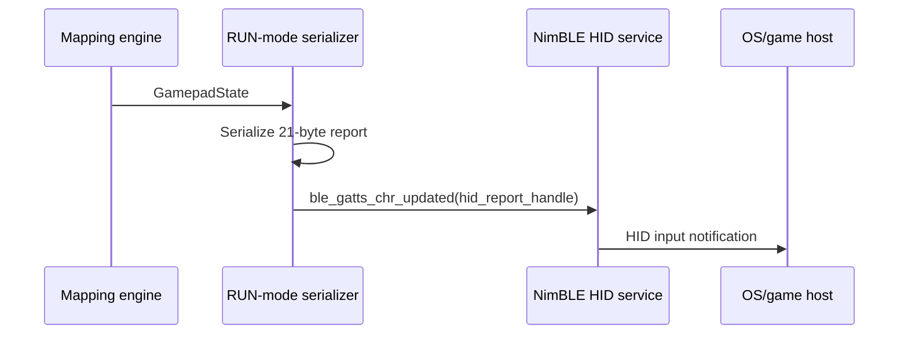

# BLE Contracts

## Purpose
Strict mapping of what the firmware sends and what the webapp expects, covering both CONFIG mode and RUN-mode HID output.

Related documents:
- [CONFIG_SCHEMA.md](CONFIG_SCHEMA.md)
- [HID_TO_GAMEPAD_MAPPING.md](HID_TO_GAMEPAD_MAPPING.md)
- [../firmware/CONFIG_SERVICE.md](../firmware/CONFIG_SERVICE.md)
- [../webapp/CONFIG_CONSOLE.md](../webapp/CONFIG_CONSOLE.md)
- [../webapp/VALIDATION_SCENE.md](../webapp/VALIDATION_SCENE.md)
- [../../AUDIT_REPORT.md](../../AUDIT_REPORT.md)

## Dependencies
- `main/ble_config_service.cpp`
- `main/ble_gamepad.cpp`
- `webapp/app.js`
- `webapp/validation.js`

## Data Structures/Interfaces
## CONFIG mode
### Service UUID map
| Name | UUID | Firmware behavior | Main console expectation | Validation scene expectation |
|---|---|---|---|---|
| Service | `6b1a2d90-9c1c-4a3f-b1e0-4fd8f5b2c1a1` | primary custom config service | requests service | requests service |
| CMD | `...c1a2` | write JSON commands | writes JSON | writes JSON |
| EVT | `...c1a3` | notify chunked responses | subscribes + reassembles | subscribes + reassembles |
| STREAM | `...c1a4` | notify 16-byte samples | subscribes on demand | subscribes immediately after connect/start |
| CFG | `...c1a5` | read/write full config blob | requested but not used on current `main` | not requested |

### EVT frame format
| Byte offset | Size | Type | Meaning |
|---|---:|---|---|
| 0 | 1 | `uint8` | protocol version, currently `1` |
| 1 | 1 | `uint8` | frame type (`1=json`, `2=descriptor`) |
| 2 | 2 | `uint16 LE` | `msg_id` |
| 4 | 2 | `uint16 LE` | chunk `offset` |
| 6 | 2 | `uint16 LE` | total payload length |
| 8.. | N | bytes | chunk payload |

### STREAM sample format
| Byte offset | Size | Type | Meaning |
|---|---:|---|---|
| 0 | 1 | `uint8` | sample version |
| 1 | 1 | `uint8` | flags |
| 2 | 4 | `uint32 LE` | `device_id` |
| 6 | 4 | `uint32 LE` | `element_id` |
| 10 | 4 | `int32 LE` | raw element value |
| 14 | 2 | `int16 LE` | normalized Q15 value |

### JSON command envelope
Request shape:
```json
{
  "rid": 1,
  "cmd": "get_devices"
}
```
Response envelope shape:
```json
{
  "evt": "resp",
  "rid": 1,
  "cmd": "get_devices"
}
```

### Command matrix
| Command | Firmware sends | Main console expects | Validation scene expects |
|---|---|---|---|
| `get_devices` | `devices[]` in JSON EVT | yes | not used |
| `get_elements` | `device_id`, `elements[]` | yes | not used |
| `get_descriptor` | JSON EVT + type-2 descriptor transfer | yes | not used |
| `start_stream` | `{ streaming: true }` | yes | yes |
| `stop_stream` | `{ streaming: false }` | yes | not used |
| `get_config` | `config` object or `config_json` string on current `main` | yes | yes, inline only |
| `set_config` | `ok`, normalized `config` object | yes | yes |
| `save_profile` | `ok`, `note`, `bytes`, usually `config` | yes | yes |
| `reboot_to_run` | `ok`, `rebooting_to` | yes | yes |
| `reboot_to_config` | `ok`, `rebooting_to` | main console only | not used |

## RUN mode
### HID wire contract
Current RUN-mode BLE HID report size is `21 bytes`.

| Segment | Size | Meaning |
|---|---:|---|
| buttons | 4 | `uint32 LE` merged button bits |
| axes | 16 | `x`, `y`, `z`, `rz`, `rx`, `ry`, `slider1`, `slider2` as 8 × `uint16 LE` |
| hat | 1 | `uint8` hat code |



## Expected State Changes
- CONFIG mode transitions between disconnected, subscribed, streaming, and rebooting states.
- RUN mode pushes HID state only while connected.

## Known Limitations
- Current `main` has asymmetry between the main console and validation scene around `CFG` support and config fallback behavior.
- Header/comment drift exists around frame types and notify pacing.
