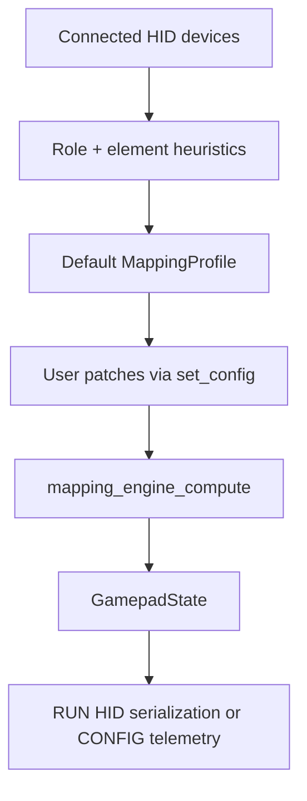

# HID to Gamepad Mapping

## Purpose
Document how descriptor-derived HID elements are converted into canonical `GamepadState` outputs and then into BLE RUN-mode semantics.

Related documents:
- [CONFIG_SCHEMA.md](CONFIG_SCHEMA.md)
- [BLE_CONTRACTS.md](BLE_CONTRACTS.md)
- [../firmware/HID_PIPELINE.md](../firmware/HID_PIPELINE.md)
- [../firmware/RUN_MODE_HID.md](../firmware/RUN_MODE_HID.md)

## Dependencies
- `main/shared_types.h`
- `main/mapping_engine.h`
- `main/mapping_engine.cpp`
- `main/main.cpp`
- `main/ble_gamepad.cpp`

## Data Structures/Interfaces
### Canonical output semantics
| Output | Meaning |
|---|---|
| `x` | primary roll / aileron |
| `y` | primary pitch / elevator |
| `z` | primary rudder |
| `rx` | left brake / aux 1 |
| `ry` | right brake / aux 2 |
| `rz` | secondary yaw / twist / rocker |
| `slider1` | throttle |
| `slider2` | aux slider / combined brake |
| `hat` | POV hat |
| `buttons` | OR-combined 32-button bitfield |

### Default profile heuristics
- Stick device preferred for `x`, `y`, and `hat`
- Throttle device preferred for `slider1`
- Pedals device preferred for `z`, `rx`, `ry`, `slider2`
- If pedals are absent, fallback logic may use stick twist or throttle rocker for `z`
- A virtual combined brake element can back `slider2`

## Expected State Changes
- Device connect/disconnect can regenerate the default profile when no user profile is active.
- User profile patches override default heuristics until replaced or cleared.
- EMA state resets when device signature or profile changes.

## Known Limitations
- `device_id` is not a globally stable hardware identity.
- `main/main.cpp` translation layer is currently identity-only and should not be used as the primary mapping reference.
